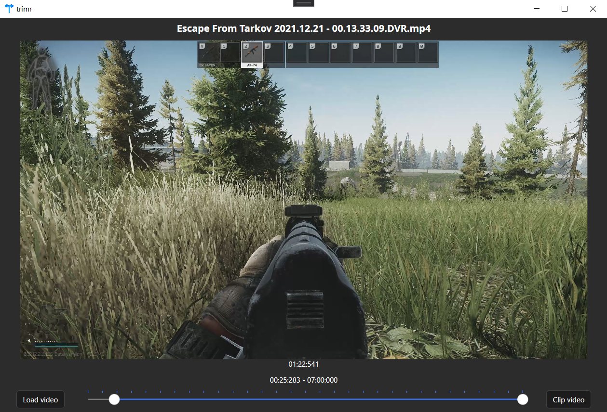

#  trimr

A simple video trimming application written in visual C# using FFmpeg.

 
# Installation
Download the latest installer from the release section. FFmpeg is included as part of the install.

You will need `.NET 5.0 Desktop Runtime (x64)` which the installer will help you install if it's not present. Also available here: https://dotnet.microsoft.com/en-us/download/dotnet/5.0/runtime

# Acknowledgements
## FFmpeg

Used to trim the videos

- FFmpeg 64-bit static Windows build from www.gyan.dev
- Version: 4.3.2-2021-02-20-essentials_build-www.gyan.dev
- License: GPL v3

Source Code: https://github.com/FFmpeg/FFmpeg/commit/f719f86990

## Icon

Icon made by <a href="https://www.flaticon.com/authors/bukeicon" title="bukeicon">bukeicon</a> from <a href="https://www.flaticon.com/" title="Flaticon">www.flaticon.com</a>

